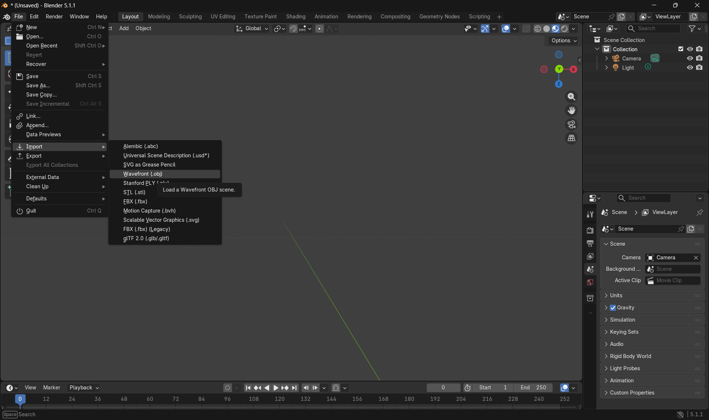
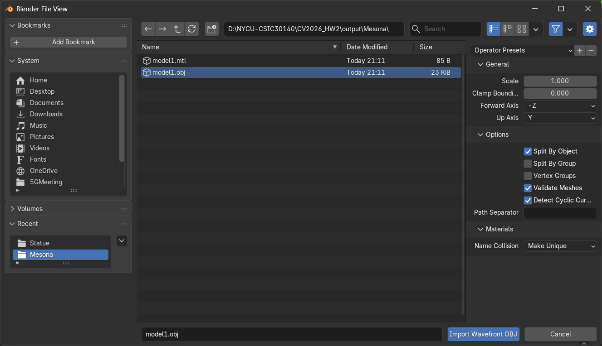
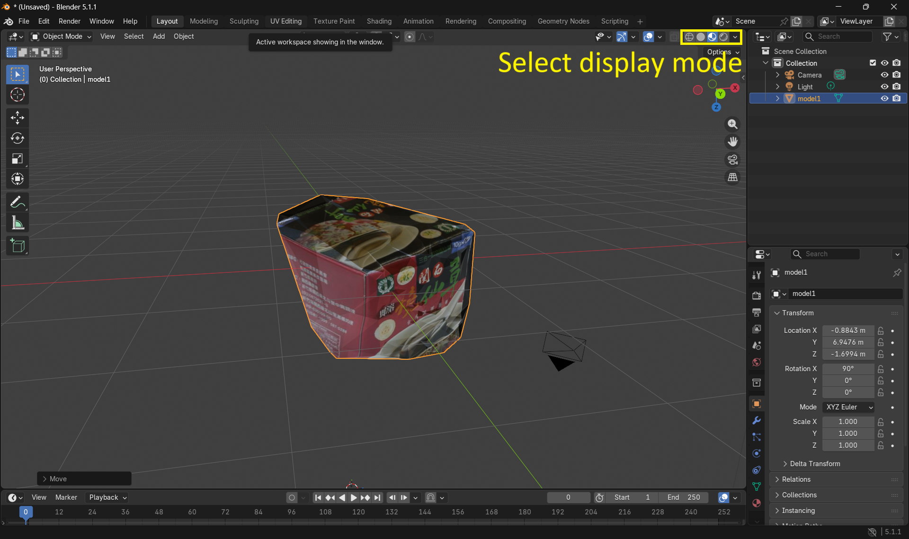
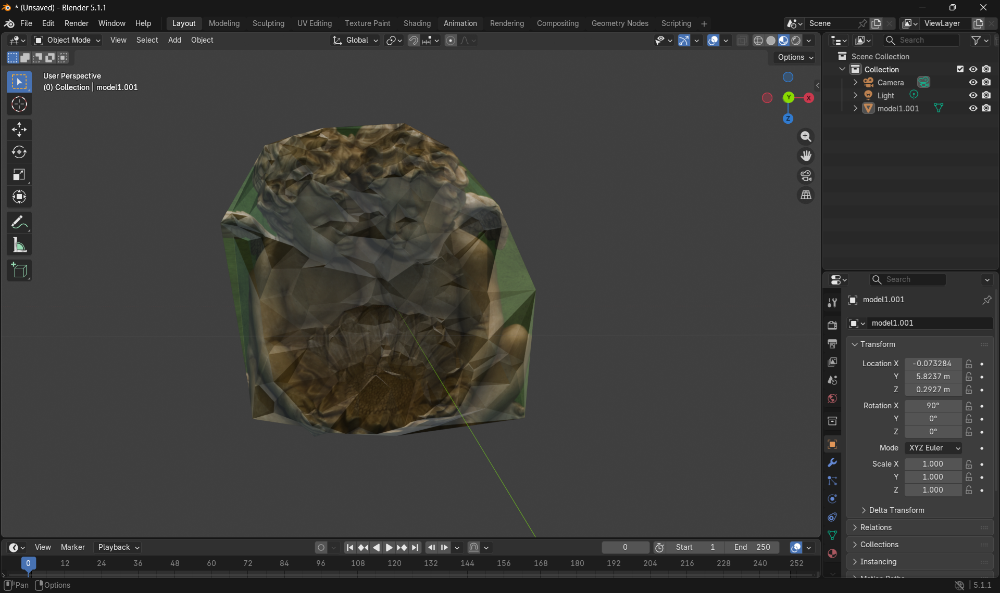
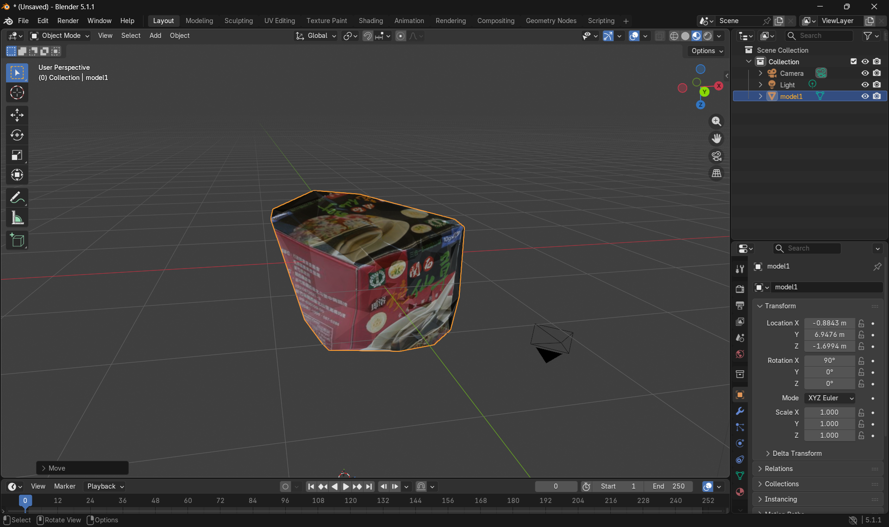

# Blender Quick Guide for This Homework

This guide shows how to open the reconstructed model and check texture mapping in Blender.

## 1. Install Blender

Download and install Blender from [https://www.blender.org/](https://www.blender.org/).

## 2. Import the OBJ model

1. Open Blender.
2. Click File -> Import -> Wavefront (.obj).
3. Select model1.obj generated by this project.
4. Keep default import options and click Import OBJ.

## 3. Basic viewport controls (very important)

1. Rotate view: hold mouse middle button and move mouse.
2. Move view (pan): hold Shift + mouse middle button and move mouse.
3. Zoom in and out: mouse wheel scroll.
4. Focus selected object: press Numpad .

If your keyboard has no numpad, enable Emulate Numpad in Blender preferences.

## 4. Check texture display

1. Switch viewport shading to Material Preview.
2. Confirm the model shows texture color from the generated texture image.
3. If texture is missing, verify model1.mtl and texture image are in the same folder as model1.obj.

## 5. Save screenshot for report

1. Adjust a clear angle using viewport controls.
2. Use Viewport Render Image or Render -> Render Image.
3. Save the image and include it in your report.

## Example results

